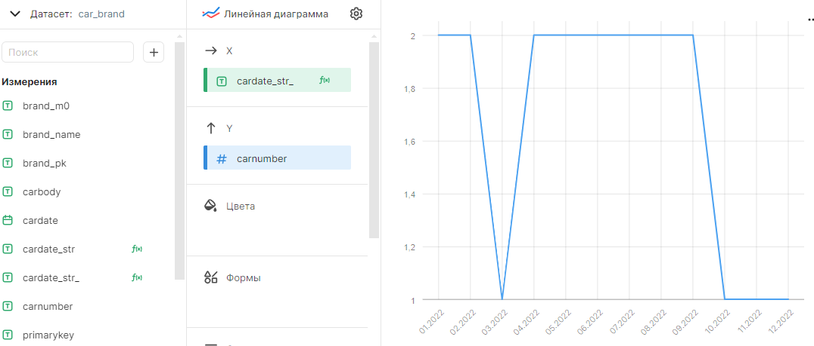

# DateTime в DataLens

## Использование в чартах

Тип даты полностью поддерживается вместе с указанным временем.

Использование временных полей для столбчатых диаграмм по оси X не предусмотрено. Для этого необходимо преобразовать его в строку с помощью нового вычислимого свойства, например:

```sql
STR([cardate])
```

При этом формат будет **yyyy-MM-dd HH:mm:ss**. Этот формат по умолчанию определяется настройками сервиса DataLens.

Преобразование в другие строковые форматы не предусмотрено.

Если нужны показания за день (формат **yyyy-MM-dd**), то придется задать следующее выражение:

```sql
CONCAT(
    STR(DATEPART([cardate], "year")),
    "-", 
    RIGHT("0" + STR(DATEPART([cardate], "month")), 2),
    "-", 
    RIGHT("0" + STR(DATEPART([cardate], "day")), 2))
```

Для формата **dd.MM.yyyy**:
```sql
CONCAT(
    RIGHT("0" + STR(DATEPART([cardate], "day")), 2),
    ".", 
    RIGHT("0" + STR(DATEPART([cardate], "month")), 2),
    ".", 
    STR(DATEPART([cardate], "year")))
```

## Пример простых чартов с датами

1. Линейная диаграмма. Количество автомобилей по месяцам.



2. Сводная таблица. Количество автомоблей по брендам по датам.


## Ссылки

1. [Функции даты и времени](https://cloud.yandex.ru/ru/docs/datalens/function-ref/date-functions)
2. [Строковые функции](https://cloud.yandex.ru/ru/docs/datalens/function-ref/string-functions)
3. [Преобразование строки к дате](https://cloud.yandex.ru/ru/docs/datalens/function-ref/DATE)