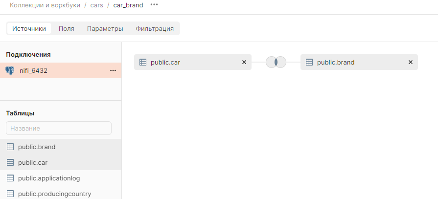
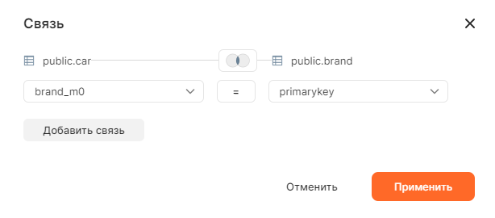
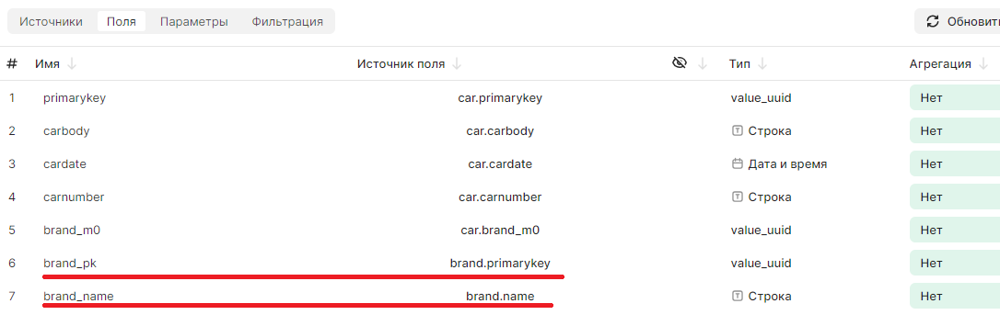
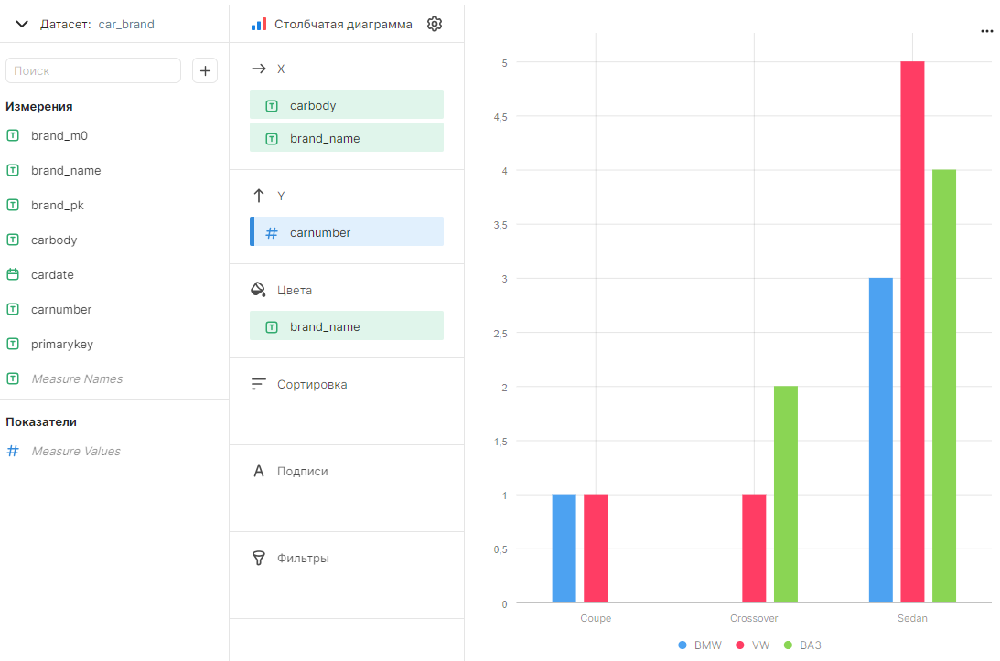

# Аналитика по данным из связанных таблиц

## Настройка набора данных

Для начала нам потребуется работающее подключение к [базе данных](Подключение%20БД%20PostgreSQL%20к%20DataLens.md).

Набор данных очень напоминает представление (View) в базе данных.

В качестве примера возьмем базу [автомобилей и брендов](../../DataSampleAirlines).

1. Создаем набор данных

И сразу добавляем в него таблицы **car** и **brand**.

Чтобы все получилось правильно, надо сначала добавить таблицу **car**, а затем таблицу **brand**, при этом наведя указателем мыши на таблицу **car**.

2. Настраиваем связь.

По умолчанию связь между таблицами не настроена и скорее всего таблицы будут связаны по полю *primaryKey*.

Устанавливаем связь **car.brand_m0** <===> **brand.primaryKey**

3. Настраиваем поля.

По умолчанию синонимы для совпадающих полей будут настроены не очень удобно. Например "primaryKey" и "primaryKey (1)", что не совсем понятно. 

Поля связанных таблиц поля можно так же обозначить более конкретно. В нашем примерере поле **name** в наборе данных относится к таблице **brand**, но это не очевидно, назавем его **brand_name**.

Применяем изменения и сохраняем набор данных.

## Пример простого чарта

1. Создаем чарт через мастера;
2. Указываем ранее созданный набор данных;
3. По оси X указываем поля **carbody** и **brand_name**;
4. По оси Y указываем поле **carnumber**;
5. В цвета указываем **brand_name**.

В итоге получим диаграмму отображения количества автомобилей по типу кузова и бренду.