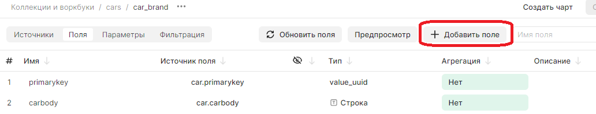
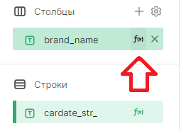

# Вычисляемые поля в DataLens

Вычисляемое поле представляет собой дополнительное поле, вычисляемое по некоторой формуле на основании других полей источника данных.

Вычисляемые выражения в DataLens имеют синтаксис, похожий на SQL.

## Создание

1. Добавить поле на вкладке `Поля` нажать кнопку `Добавить поле`;



2. Редактирование поля по кнопке `f(x)` в любом месте где его можно использовать, например в чартах.



## Синтаксис

Синтаксис обращения к полям датасета аналогичен Transact-SQL, но в случае DataLens требуется заключать имя поля в квадратные скобки (`[]`)

```sql
[Имя поля]
```

## Константы

Кроме полей, операторов и функций, в выражениях могут участвовать константы разных типов данных:

1. Числа: `23`, `-4325653`, `0.0234`, `-1.0`;
2. Дата или дата и время: `#2020-01-01#` или `#2020-01-01 11:15:00#`;
3. Строки указывают в кавычках: `"Строка"`;
4. Логический: `TRUE`, `FALSE`;
5. Геоточка: `GEOPOINT("[55.7912,37.6872]")`.

## Операторы

1. Арифметические: `+`, `-`, `*`, `/`;
2. Возведение в степень: `^`;
3. Остаток от деления: `%`;
4. Логические: `AND`, `OR`, `NOT`, `IN`, `LIKE`, `IS TRUE`, `IS FALSE`,`BETWEEN`;
5. Сравнения: `=`, `!=`, `<`, `<=`, `>`, `>=`.

## Комментарии

1. Однострочный комментарий.
```sql
-- Это однострочный комментарий
```

2. Блоковый комментарий.
```sql
/* Это блоковый комментарий */
```

## Логические операции

1. `CASE`
```sql
CASE [ProductID]
    WHEN 1 THEN "Bananas"
    WHEN 2 THEN "Apples"
    WHEN 3 THEN "Pears"
    ELSE "Other"
END
```

2. `IF`
```sql
IF ([MassIndex] BETWEEN 18.5 AND 25, "Normally", "Not normal")
```

3. `IFNULL` - Возвращает первое значение, если оно не NULL. В противном случае возвращает второе значение;

```sql
IFNULL([Cost Price], 10) * [OrderCount]
```

4. `ISNULL` - Возвращает TRUE, если выражение является NULL. В противном случае возвращает FALSE.

```sql
IF(ISNULL([Product Name]) = TRUE, "Unnamed", [Product Name] + " " + [ProductID])
```

5. `ZN` - Возвращает значение выражения выражение, если оно не NULL. В противном случае возвращает 0.

```sql
ZN([Total Sales]) - ZN([Total Cost])
```

## Строковые функции

```sql
CONCAT([Total Sales], "$")

IF(CONTAINS([Product Name], "RU"), [Product Cost] + " " + "RUB", [Product Cost] + " " + "USD")

REPLACE([OrderID], "2020", [Month])

IF(STARTSWITH([Region Name], "RU_"), SPLIT([Region Name], "_", 2), [Region Name])
```

Строки могут быть заданы с помощью одиночных или двойных кавычек. При этом один вид кавычек может использоваться внутри другого:
```sql
FIND([Product Name], 'plus')

CONCAT('"', [Product Name], '"')
```

Специальные символы `\n`, `\t`, `\r` не влияют на отображение исходных данных.

[Полный список строковых функций](https://datalens.tech/docs/ru/function-ref/string-functions.html)

## Преобразование типов
Значения выражений могут быть переведены из одного типа в другой:
```sql
FLOAT([StringWithNumbers])

DATETIME(STR([Order Date]) + "-" + STR([Order Time]))

GEOPOINT([Latitude], [Longitude])
```

[Полное описание функций преобразования типов](https://datalens.tech/docs/ru/function-ref/type-conversion-functions.html)

## Агрегирование
Для вычисления результирующих значений используются агрегатные функции:

```sql
AVG([Check Total]) * COUNTD([CustomerID])

SUM_IF([Sales], [Category] = "Fruits")

IF MIN[Date] = #2020-01-01#
    THEN SUM[Sales] * 1.1
    ELSE SUM[Sales] * 1.2
END
```

Оконные функции позволяют агрегировать значения из группы строк, не объединяя сами эти строки в одну, что отличает их от агрегатных. Также оконные функции позволяют рассчитывать значения для одной строки в контексте значений из других строк.

```sql
SUM([Sales] WITHIN [PaymentType]) / SUM([Sales] TOTAL)

MSUM([Sales per Order], 1 WITHIN [ProductID] ORDER BY [Price])

RANK_DENSE(AVG([Price]), "desc" WITHIN [ShopID] BEFORE FILTER BY [PaymentType])
```

Оконные функции поддерживают группировку и сортировку записей, а также опцию `BEFORE FILTER BY`.

[Полный список оконных функций](https://datalens.tech/docs/ru/function-ref/window-functions.html)

## Разметка текста
Для создания размеченного текста используются функции разметки:
```sql
MARKUP(BOLD("This"), " ", ITALIC("is"), " ", URL("https://example.com/", [LinkName]))
```

Чтобы использовать числовые константы при разметке URL-адреса, необходимо их привести к типу `Строка`:

```sql
URL("https://example.com/?value=" + STR([Value]), [Value])
```

[Полный список функций разметки](https://datalens.tech/docs/ru/function-ref/markup-functions.html)

## Ссылки

1. [Поддержка функций различными источниками СУБД](https://datalens.tech/docs/ru/function-ref/availability.html)
2. [Вычисляемые поля (официальная документация)](https://datalens.tech/docs/ru/concepts/calculations/)