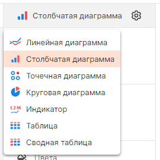
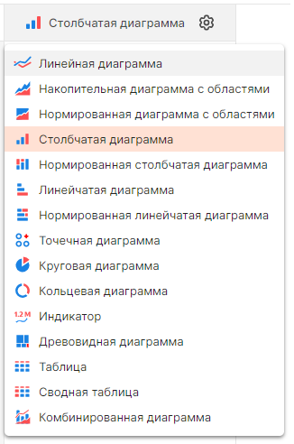

# Доступные визуализации в DataLens
В DataLens допустимо использовать 2 вида визуализаций:
- D3.js
- Highcharts

## D3.js
D3.js используется при параметре ``HC=0`` (или ``HC: 0`` в docker-compose.yml).

С D3.js доступны лишь несколько типов визуализаций:

Работа по добавлению новых визуализаций продолжается и планируется полностью заменить Highcharts на D3 в DataLens (см. [Notice on Highcharts usage](https://github.com/datalens-tech/datalens)).

## Highcharts
Highcharts используется при параметре ``HC=1`` (или ``HC: 1`` в docker-compose.yml).

Highcharts — это запатентованный коммерческий продукт. Если планируется включить Highcharts в своем экземпляре DataLens, необходимо соблюдать [лицензию Highcharts](https://github.com/highcharts/highcharts/blob/master/license.txt).

Визуализации доступные с Highcharts:

