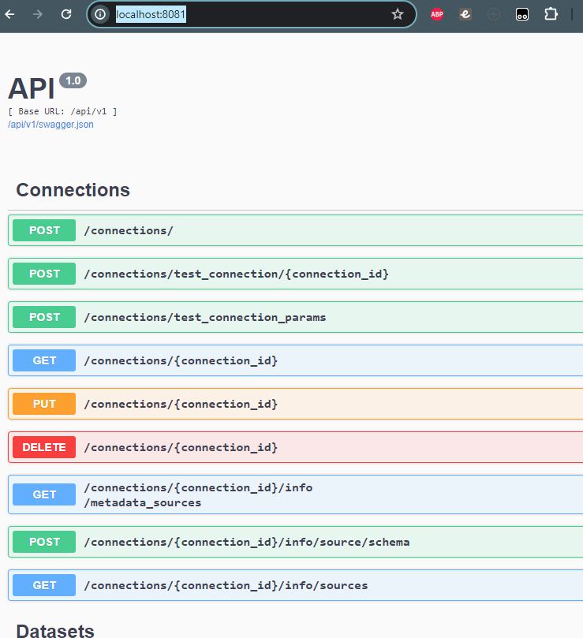

# Импорт и экспорт настроек в DataLens

Веб-интерфейс DataLens не предусматривает импорт/экспорт объектов настроек (соединения, дата сеты, чарты, дашборды и т.п.) во внешние файлы.

Все данные хранятся в настроеной БД PostgreSQL в образе докера `datalens/pg-us`

```yml
pg-us:
    image: datalens/pg-us
    ports:
      - 5433:5432
    environment:
      POSTGRES_DB: us-db-ci_purgeable
      POSTGRES_USER: us
      POSTGRES_PASSWORD: us
    volumes:
      - PgUsDB:/var/lib/postgresql/data
```

## Способы сохранить настройки и применить сохраненные ранее настройки объектов

1. Настроить мапирование данных в докер образе на локальную папку

```yml
pg-us:
    image: datalens/pg-us
    ...
    volumes:
      - /metadata:/var/lib/postgresql/data
```

Данный способ используется в тестовом примере от самомого DataLens.

2. Поднять БД datalens/pg-us в отдельном образе или на реальном сервере. Делать и поднимать нужный бекап;
3. Добавлять нужные объекты скриптами напрямую в БД, например через pgAdmin;
4. Использовать `Control API` программно или например через PostMan

```yml
control-api:
    image: datalens/control-api
    ports:
      - 8081:8080
    environment:
      ...
```

