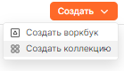

# Подключение БД PostgreSQL к DataLens

Для начала работы необходимо открыть веб-интерфейс DataLens. Если он запущен локально, то это http://localhost:8080/collections

## Создание воркбука

Если в системе еще нет воркбуков, то можно нажать кнопку по центру страницы

Либо в правом верхнем углу выбрать пункт создать воркбук

## Создание подключения

В выбранном воркбуке выбираем раздел подключения, пункт **Создать подключение**:

Выбираем пункт PostgreSQL и заполняем параметры подключения.

Обязательно проверяем подключение по кнопке **Проверить подключение** для изежания проблем в дальнейшем.

Затем данныое подключение можно использовать в любом датасете выбранного воркбука. Информация о таблицах подгрузится автоматически.